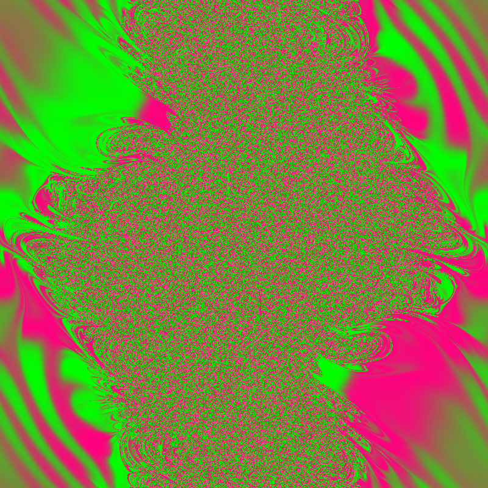

# double pendulum fractal visualization



program generates animated fractals visualizing chaotic dynamics of double pendulum system. patterns reveal intricate structure in phase space of initial conditions.


## how it works

### physics: double pendulum dynamics

double pendulum consists of two masses connected by rigid rods, second pendulum attached to first. system exhibits chaotic behavior - small changes in initial conditions lead to different trajectories.

system described by four variables:
- $\theta_1$: angle of first pendulum from vertical
- $\omega_1$: angular velocity of first pendulum
- $\theta_2$: angle of second pendulum from vertical
- $\omega_2$: angular velocity of second pendulum

### mathematical foundation

equations of motion derived from lagrangian mechanics:

**kinetic energy:**
$$t = \frac{1}{2} m_1 l_1^2 \omega_1^2 + \frac{1}{2} m_2 [l_1^2 \omega_1^2 + l_2^2 \omega_2^2 + 2 l_1 l_2 \omega_1 \omega_2 \cos(\theta_1 - \theta_2)]$$

**potential energy:**
$$v = -m_1 g l_1 \cos \theta_1 - m_2 g [l_1 \cos \theta_1 + l_2 \cos \theta_2]$$

**euler-lagrange equations:**
equations of motion:
$$\frac{d^2 \theta_1}{dt^2} = f_1(\theta_1, \theta_2, \omega_1, \omega_2)$$
$$\frac{d^2 \theta_2}{dt^2} = f_2(\theta_1, \theta_2, \omega_1, \omega_2)$$

solved numerically using 4th-order runge-kutta method for accuracy.

### fractal generation process

1. **phase space mapping**: each pixel $(x,y)$ corresponds to initial conditions $(\theta_1, \theta_2) \in [0, 2\pi)^2$
2. **dynamics simulation**: for each initial condition, simulate pendulum motion forward in time
3. **color mapping**: final state determines pixel color, creating fractal pattern
4. **animation**: varying phase offset creates moving window through phase space

### why fractals emerge

fractal patterns arise from sensitive dependence on initial conditions characteristic of chaotic systems. nearby points in phase space can have different final states, creating self-similar structures.

animation reveals patterns evolve as sweep through different regions of initial condition space, showcasing dynamic nature of chaotic dynamics.

## usage

```bash
cargo run
```

generates `double_pendulum_anim.gif` showing animated fractal pattern.

## params

modify simulation parameters in code:
- **image size**: `width` and `height` (default: 320×320)
- **animation**: `frames` (default: 60) and `fps` (default: 20)
- **physics**: masses (`m1`, `m2`), lengths (`l1`, `l2`), time step (`dt`)
- **quality**: integration steps per pixel (`steps`)
